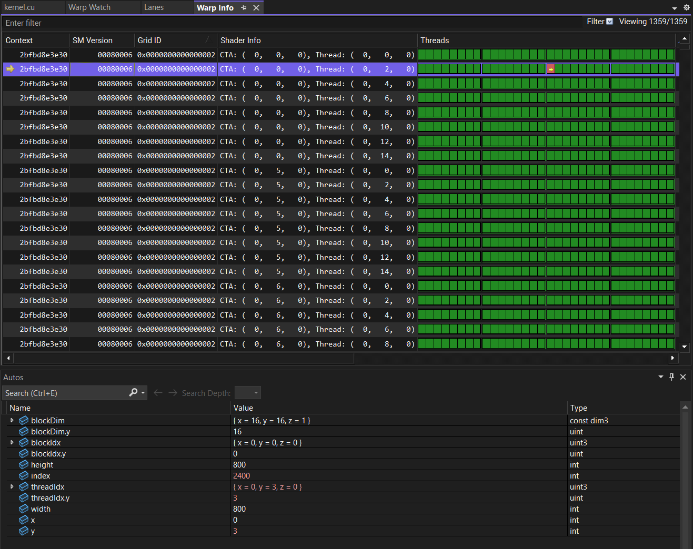
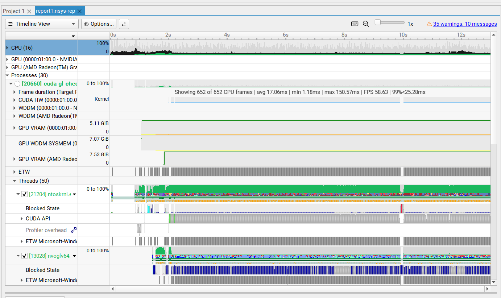
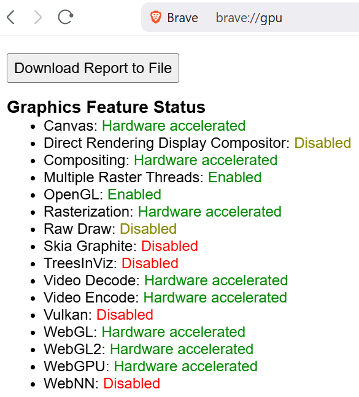
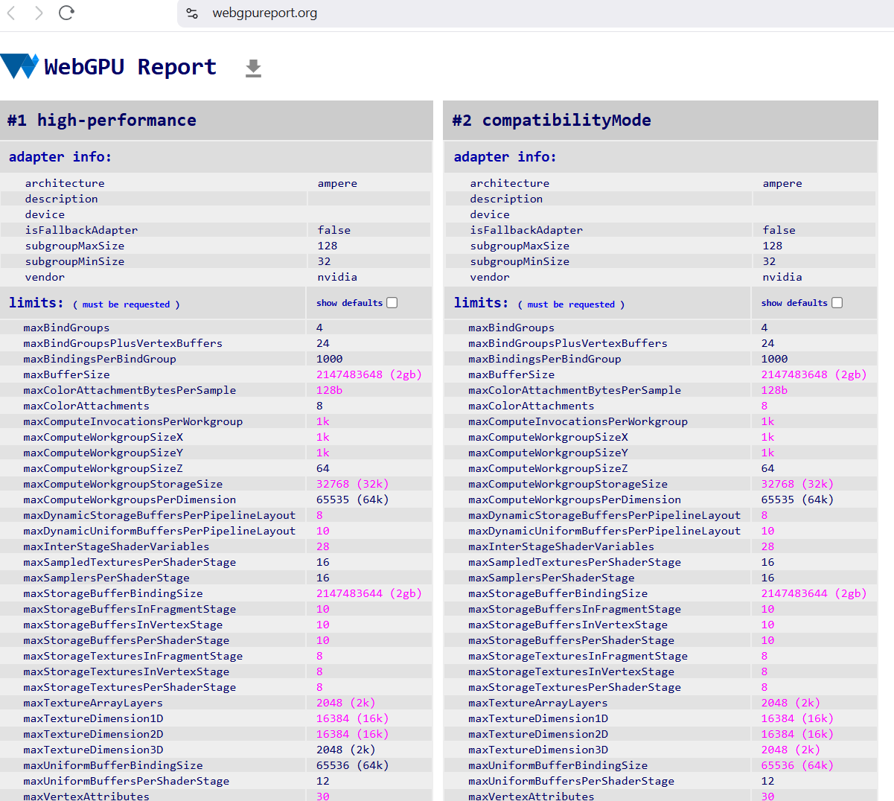

Project 0 Getting Started
====================

**University of Pennsylvania, CIS 5650: GPU Programming and Architecture, Project 0**

* Lu Men
  * [LinkedIn](https://www.linkedin.com/in/lu-m-673425323/)
* Tested on PC: Windows 11 Home, AMD Ryzen 7 5800HS @ 3.20GHz 16GB, NVIDIA GeForce RTX 3060 Laptop GPU 6GB (Compute Capability 8.6)

### Part 2.1.2

### Part 2.1.3

### Part 2.1.4

### Part 2.1.5

Nsight Compute error encountered.

### Part 2.2

### Part 2.3

