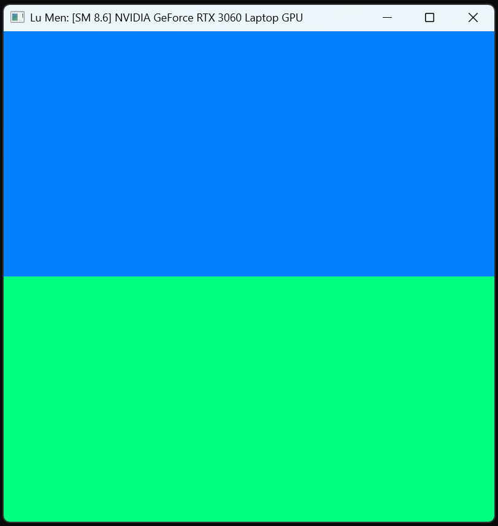

Project 0 Getting Started
====================

**University of Pennsylvania, CIS 5650: GPU Programming and Architecture, Project 0**

* Lu Men
  * (TODO) [LinkedIn](), [personal website](), [twitter](), etc.
* Tested on: Windows 11 Home, AMD Ryzen 7 5800HS @ 3.20GHz 16GB, NVIDIA GeForce RTX 3060 Laptop GPU 6GB (Compute Capability 8.6)

### Part 2.1.2

